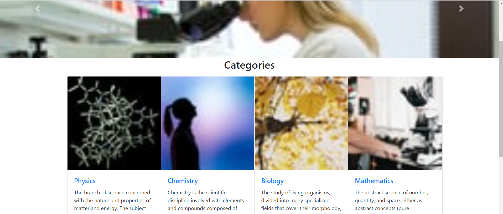
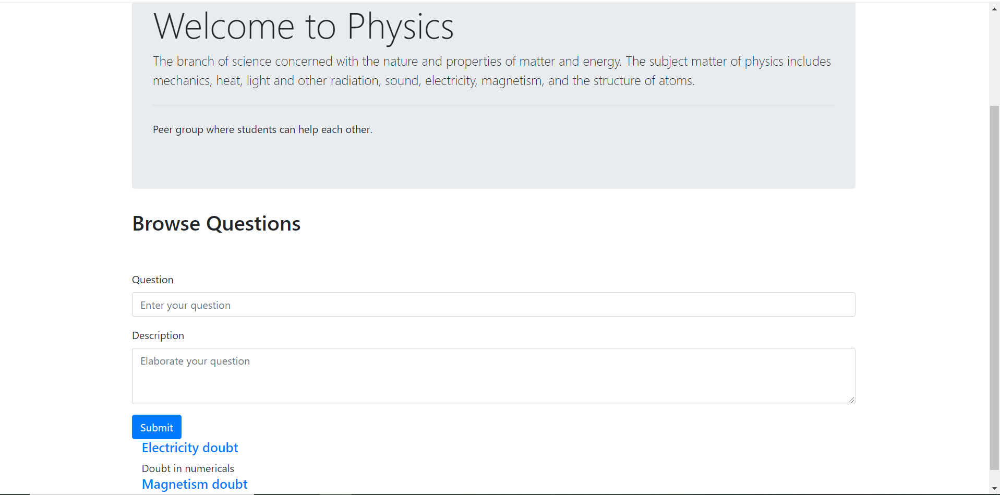
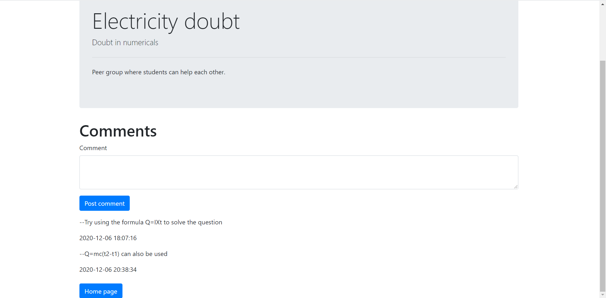
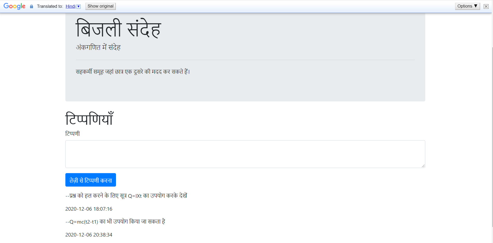
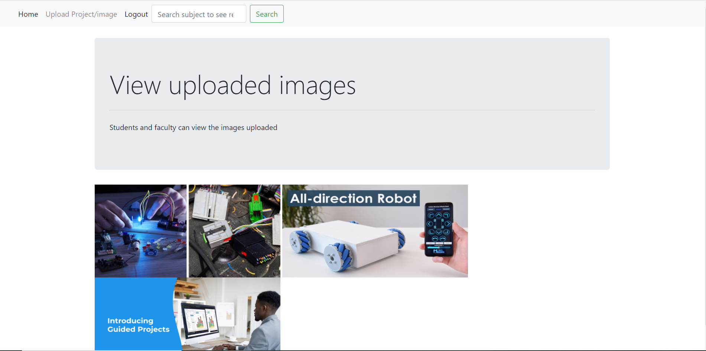
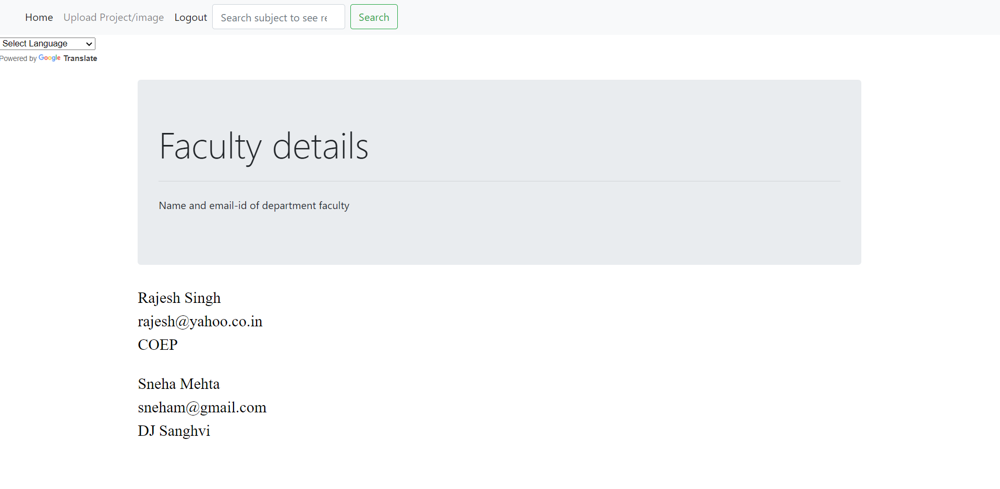

# SE-hackathon-student-mentor-forum-
A platform/portal where student can put up their projects, share their problems , contribute to projects, help in academics and connect with mentors.

#### Tech Stack used
Front-end : HTML, CSS, Bootstrap\
Backend : Php\
Database : MySQL

 ## Screenshots
 ##### Homepage
 
 
 ##### Various Subject Categories
 
 
 ##### Particular Subject Questions
 
 
  ##### Particular Question Thread
 
 
   ##### View webpages in desired language
 
 
   ##### Upload and view previous doubts via images
 
 
   ##### Search for faculty of a particular subject
 
 
 *For more images of the website checkout the screenshots folder.*
